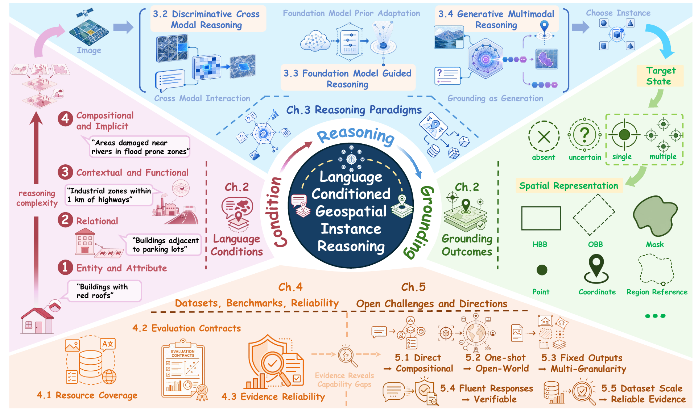
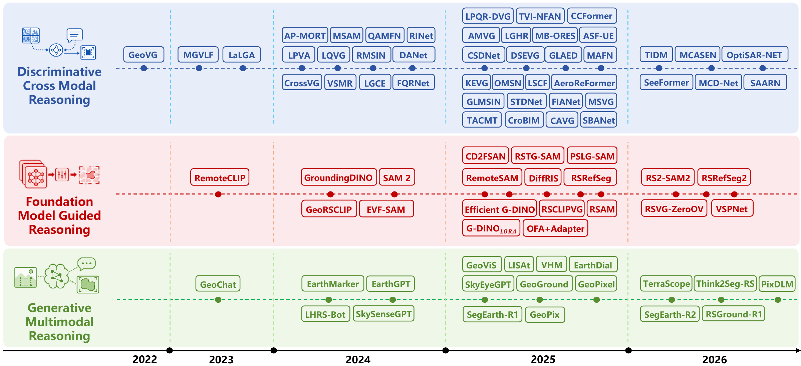
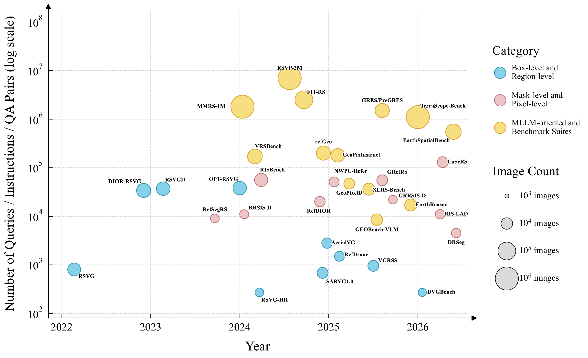

<p align="center">
  
</p>

<h1 align="center">Awesome LC-GIR</h1>

<p align="center">
  <strong>Language-Conditioned Geospatial Instance Reasoning in Remote Sensing</strong>
</p>

<p align="center">
  A curated collection of papers, official codebases, datasets, and benchmarks for language-guided geospatial instance reasoning.
</p>

<p align="center">
  <a href="https://github.com/Haowen03/LC-GIR/stargazers"></a>
  <a href="https://github.com/Haowen03/LC-GIR/issues"></a>
  
  
</p>

<p align="center">
  <a href="#1-papers-and-code">Papers &amp; Code</a> ·
  <a href="#2-transferable-foundations">Transferable Foundations</a> ·
  <a href="#3-datasets-and-benchmarks">Datasets &amp; Benchmarks</a> ·
  <a href="#4-contribution-guide">Contribute</a> ·
  <a href="#5-citation">Citation</a>
</p>

---

## About

This repository accompanies the survey:

> **Language-Conditioned Geospatial Instance Reasoning in Remote Sensing: A Survey**

**LC-GIR** unifies box-level remote sensing visual grounding, mask-level referring remote sensing image segmentation, joint box-mask grounding, generalized target settings, and MLLM-driven grounding. The survey organizes this space through the **Condition-Reasoning-Grounding (CRG)** framework.

<p align="center">
  
</p>

### Taxonomy at a Glance

Methods are grouped by the dominant mechanism used for geospatial instance selection:

1. **Discriminative Cross Modal Reasoning** - task-specific interaction, relational disambiguation, structure-aware reasoning, and target-state reasoning.
2. **Foundation Model Guided Reasoning** - semantic, proposal, and region priors transferred from pretrained foundation models.
3. **Generative Multimodal Reasoning** - structured geometry, dense regions, or explicit reasoning actions generated by multimodal models.

Datasets are grouped by their primary annotation or evaluation interface: **box grounding**, **mask grounding**, **joint box-mask grounding**, **instruction data**, and **reasoning benchmarks**.

---

## Contents

- [1. Papers and Code](#1-papers-and-code)
  - [1.1 Discriminative Cross Modal Reasoning](#11-discriminative-cross-modal-reasoning)
  - [1.2 Foundation Model Guided Reasoning](#12-foundation-model-guided-reasoning)
  - [1.3 Generative Multimodal Reasoning](#13-generative-multimodal-reasoning)
- [2. Transferable Foundations](#2-transferable-foundations)
  - [2.1 Discriminative Foundations](#21-discriminative-foundations)
  - [2.2 Foundation-Model Priors](#22-foundation-model-priors)
  - [2.3 Generative Grounding Foundations](#23-generative-grounding-foundations)
- [3. Datasets and Benchmarks](#3-datasets-and-benchmarks)
  - [3.1 Box Grounding](#31-box-grounding)
  - [3.2 Mask Grounding](#32-mask-grounding)
  - [3.3 Joint Box–Mask Grounding](#33-joint-boxmask-grounding)
  - [3.4 Instruction Data](#34-instruction-data)
  - [3.5 Reasoning Benchmarks](#35-reasoning-benchmarks)
- [4. Contribution Guide](#4-contribution-guide)
- [5. Citation](#5-citation)

---

## Link Status

- **Paper** links point to publisher pages, CVF/PMLR proceedings, or arXiv.
- **Code** links point to author-maintained repositories when identifiable.
- **Dataset** links point to official project pages, repositories, or released data pages.
- `—` means that no official public link is currently listed.
- Some repositories host both code and data and therefore appear in both columns.
- Please open an issue or pull request when an official link is missing or has changed.

## Inclusion and Quality Policy

The main tables contain **Core LC-GIR Methods**. A core method must accept an explicit language condition, perform instance-level selection, and return an inspectable spatial result such as a box, mask, point, coordinate, or region reference.

Related natural-image grounding, open-vocabulary detection, promptable segmentation, and general reasoning-segmentation methods are listed separately under **Transferable Foundations**.

Status conventions used in notes and future pull requests:

- `🏛️` peer-reviewed conference or journal paper
- `🧪` recent preprint with substantial experiments, code, data, or a new evaluation setting
- `💻` official code verified
- `🗂️` official dataset or benchmark verified
- `⏳` code or data announced but not yet public

Recent preprints should normally satisfy at least two of the following conditions: evaluation on multiple LC-GIR benchmarks, release of code/data/weights, a new task or protocol, a distinct reasoning mechanism, or acceptance at a major venue whose official page is not yet available.

---

## 1. Papers and Code

<p align="center">
  
</p>

<p align="center"><em>Chronological development of discriminative, foundation-guided, and generative LC-GIR methods.</em></p>

### 1.1 Discriminative Cross Modal Reasoning

#### A. Semantic Correspondence Reasoning

| Year | Venue | Method | Paper | Code | Dataset / Project |
|---:|:---:|---|---|---|---|
| 2022 | ACM MM | GeoVG | [Visual Grounding in Remote Sensing Images](https://sunyuxi.github.io/publication/GeoVG) | [Code](https://github.com/sunyuxi/RSVG-pytorch) | [RSVG](https://sunyuxi.github.io/publication/GeoVG) |
| 2023 | TGRS | RSVG / MGVLF | [RSVG: Exploring Data and Models for Visual Grounding on Remote Sensing Data](https://arxiv.org/abs/2210.12634) | [Code](https://github.com/ZhanYang-nwpu/RSVG-pytorch) | [DIOR-RSVG](https://github.com/ZhanYang-nwpu/RSVG-pytorch) |
| 2023 | arXiv | LaLGA | LaLGA: Multi-Scale Language-Aware Visual Grounding on Remote Sensing Data | — | — |
| 2024 | TGRS | LPVA | [Language-Guided Progressive Attention for Visual Grounding in Remote Sensing Images](https://doi.org/10.1109/TGRS.2024.3423663) | [Code](https://github.com/like413/OPT-RSVG) | [OPT-RSVG](https://github.com/like413/OPT-RSVG) |
| 2024 | TGRS | LQVG | [Language Query-Based Transformer With Multiscale Cross-Modal Alignment for Visual Grounding on Remote Sensing Images](https://doi.org/10.1109/TGRS.2024.3407598) | [Code](https://github.com/LANMNG/LQVG) | [RSVG-HR](https://github.com/LANMNG/LQVG) |
| 2024 | IGARSS | CrossVG | CrossVG: Visual Grounding in Remote Sensing with Modality-Guided Interactions | — | — |
| 2024 | IGARSS | AP-MORT | Attribute-Prompting Multi-Modal Object Reasoning Transformer for Remote Sensing Visual Grounding | — | — |
| 2024 | CVPR | RMSIN | [Rotated Multi-Scale Interaction Network for Referring Remote Sensing Image Segmentation](https://openaccess.thecvf.com/content/CVPR2024/html/Liu_Rotated_Multi-Scale_Interaction_Network_for_Referring_Remote_Sensing_Image_Segmentation_CVPR_2024_paper.html) | [Code](https://github.com/Lsan2401/RMSIN) | [RRSIS-D](https://github.com/Lsan2401/RMSIN) |
| 2024 | ACM MM | DANet | [Rethinking the Implicit Optimization Paradigm with Dual Alignments for Referring Remote Sensing Image Segmentation](https://doi.org/10.1145/3664647.3681318) | — | — |
| 2024 | arXiv | CroBIM | [Cross-Modal Bidirectional Interaction Model for Referring Remote Sensing Image Segmentation](https://arxiv.org/abs/2410.08613) | [Code](https://github.com/HIT-SIRS/CroBIM) | [RISBench](https://github.com/HIT-SIRS/CroBIM) |
| 2024 | GRSL | VSMR | [Visual Selection and Multistage Reasoning for RSVG](https://doi.org/10.1109/LGRS.2024.3386311) | — | — |
| 2024 | GRSL | MSAM | [Multi-Stage Synergistic Aggregation Network for Remote Sensing Visual Grounding](https://doi.org/10.1109/LGRS.2024.3360473) | — | — |
| 2024 | TGRS | RINet | [A Regionally Indicated Visual Grounding Network for Remote Sensing Images](https://doi.org/10.1109/TGRS.2024.3490847) | — | — |
| 2024 | TGRS | FQRNet | [A Spatial Frequency Fusion Strategy Based on Linguistic Query Refinement for RSVG](https://doi.org/10.1109/TGRS.2024.3471082) | — | — |
| 2025 | JSTARS | CADFormer | [CADFormer: Fine-Grained Cross-Modal Alignment and Decoding Transformer for Referring Remote Sensing Image Segmentation](https://arxiv.org/abs/2503.23456) | [Code](https://github.com/zxk688/CADFormer) | [RRSIS-HR](https://github.com/zxk688/CADFormer) |
| 2025 | TGRS | FIANet | Fine-Grained Image–Text Alignment Network for Referring Remote Sensing Image Segmentation | [Code](https://github.com/Shaosifan/FIANet) | — |
| 2025 | GRSL | MAFN | [Multimodal-Aware Fusion Network for Referring Remote Sensing Image Segmentation](https://arxiv.org/abs/2503.11183) | [Code](https://github.com/Roaxy/MAFN) | — |
| 2025 | Remote Sensing | TVI-MFAN | [A Text–Visual Interaction Multilevel Feature Alignment Network for Visual Grounding in Remote Sensing](https://doi.org/10.3390/rs17172993) | — | — |
| 2025 | ISPRS JPRS | SBANet | [Scale-Wise Bidirectional Alignment Network for Referring Remote Sensing Image Segmentation](https://arxiv.org/abs/2501.00851) | ⏳ | — |
| 2025 | TGRS | LPQR-DVG | [Language-Guided Progressive Query Refinement With Diffusion Model for Visual Grounding on Remote Sensing Images](https://doi.org/10.1109/TGRS.2025.3622554) | [Code](https://github.com/TangXu-Group/LPQR-DVG) | — |
| 2026 | Remote Sensing | TIDM | Text-Injected Discriminative Model for Remote Sensing Visual Grounding | — | — |

#### B. Relational and Contextual Disambiguation

| Year | Venue | Method | Paper | Code | Dataset / Project |
|---:|:---:|---|---|---|---|
| 2025 | Information Fusion | CSDNet | Context-Driven and Sparse Decoding for Remote Sensing Visual Grounding | — | — |
| 2025 | TGRS | DSEVG | Directional-Semantic-Enhanced Visual Grounding for Remote Sensing Images | — | — |
| 2025 | IJCAI | LGHR | Language-Guided Hybrid Representation Learning for Visual Grounding on Remote Sensing Images | — | — |
| 2025 | TGRS | GLAED | Global–Local Association-Enhanced Visual Grounding in Remote Sensing Images | — | — |
| 2025 | IJAEOG | KEVG | Knowledge-Enhanced Visual Grounding for Remote Sensing Images | [Code](https://github.com/WHULuoJiaTeam/KEVG) | [LuoJia-VG](https://www.sciencedirect.com/science/article/pii/S156984322500353X) |
| 2025 | — | MB-ORES | Multi-Branch Object Reasoner for Visual Grounding in Remote Sensing | [Code](https://github.com/rd20karim/MB-ORES) | — |
| 2025 | TGRS | LSCF | [Long-Term Semantic-Guidance ConvFormer for Referring Remote Sensing Image Segmentation](https://doi.org/10.1109/TGRS.2025.3578515) | ⏳ | — |
| 2026 | arXiv | ProVG | [Progressive Visual Grounding via Language Decoupling for Remote Sensing Imagery](https://arxiv.org/abs/2604.01893) | — | RRSIS-D / RISBench |
| 2026 | arXiv | OptiSAR-Net++ | [A Large-Scale Benchmark and Transformer-Free Framework for Cross-Domain Remote Sensing Visual Grounding](https://arxiv.org/abs/2603.24876) | — | [OptSAR-RSVG](https://arxiv.org/abs/2603.24876) |

#### C. Structure-Aware Spatial Reasoning

| Year | Venue | Method | Paper | Code | Dataset / Project |
|---:|:---:|---|---|---|---|
| 2024 | TGRS | RRSIS | Referring Remote Sensing Image Segmentation | [Code / Data](https://github.com/zhu-xlab/rrsis) | [RefSegRS](https://github.com/zhu-xlab/rrsis) |
| 2025 | JSTARS | STDNet | Spatial–Textual Decoupling Network for Referring Remote Sensing Image Segmentation | — | — |
| 2025 | TGRS | MCASEN | Multi-Level Cross-Hierarchical Alignment and Spatial Enhancement Network | — | — |
| 2025 | GRSM | CCFormer / RRSECS | [RRSECS: Referring Remote Sensing Expression Comprehension and Segmentation](https://ieeexplore.ieee.org/document/11036256/) | — | [RefDIOR](https://ieeexplore.ieee.org/document/11036256/) |
| 2025 | arXiv | MRSNet | [A Large-Scale Referring Remote Sensing Image Segmentation Dataset and Benchmark](https://arxiv.org/abs/2506.03583) | [Code](https://github.com/CVer-Yang/NWPU-Refer) | [NWPU-Refer](https://github.com/CVer-Yang/NWPU-Refer) |
| 2025 | JSTARS | GL-MSIN | [A Global–Local Hierarchical Multiscale Interaction Network for Referring Remote Sensing Image Segmentation](https://scholar.xjtu.edu.cn/en/publications/gl-msin-a-globallocal-hierarchical-multiscale-interaction-network/) | — | GRefRS |
| 2025 | IJAEOG | AeroReFormer | [Aerial Referring Transformer for UAV-Based Referring Image Segmentation](https://arxiv.org/abs/2502.16680) | [Code](https://github.com/lironui/AeroReformer) | [UAVid-RIS / VDD-RIS](https://github.com/lironui/AeroReformer) |
| 2026 | TGRS | MCD-Net | Multimodal Cross-Hierarchical Decoding Network | — | — |
| 2026 | TPAMI | SeeFormer | Like Human Rethinking: Contour Transformer AutoRegression for Referring Remote Sensing Interpretation | — | — |
| 2026 | TGRS | CroBIM-U | [Uncertainty-Driven Referring Remote Sensing Image Segmentation](https://arxiv.org/abs/2601.03490) | — | Uncertainty-aware evaluation |

#### D. Candidate-Set and Target-State Reasoning

| Year | Venue | Method | Paper | Code | Dataset / Project |
|---:|:---:|---|---|---|---|
| 2025 | Information Fusion | MAGRET | MAGRET: A Dataset for Multi-Target Visual Grounding in Remote Sensing Images with Cross-Modal Annotations | [Code / Data](https://github.com/jiehaoxue/MAGRET) | [MAGRET](https://github.com/jiehaoxue/MAGRET) |
| 2025 | TGRS | OMSN / GRRSIS | [GRRSIS: Generalized Referring Remote Sensing Image Segmentation](https://scholar.xjtu.edu.cn/en/publications/grrsis-generalized-referring-remote-sensing-image-segmentation/) | — | [GRRSIS-D](https://scholar.xjtu.edu.cn/en/publications/grrsis-generalized-referring-remote-sensing-image-segmentation/) |
| 2025 | arXiv | RefDrone baseline | [A Challenging Benchmark for Referring Expression Comprehension in Drone Scenes](https://arxiv.org/abs/2502.00392) | [Project](https://github.com/sunzc-sunny/refdrone) | [RefDrone](https://github.com/sunzc-sunny/refdrone) |
| 2026 | AAAI | Presence and Plurality Reasoning | Improving Target Presence and Plurality Recognition for Generalized Referring Image Segmentation | — | — |

---

### 1.2 Foundation Model Guided Reasoning

#### A. Semantic Prior Transfer

| Year | Venue | Method | Paper | Code | Dataset / Model |
|---:|:---:|---|---|---|---|
| 2024 | TGRS | RemoteCLIP | [RemoteCLIP: A Vision Language Foundation Model for Remote Sensing](https://arxiv.org/abs/2306.11029) | [Code](https://github.com/ChenDelong1999/RemoteCLIP) | [Models / Data](https://github.com/ChenDelong1999/RemoteCLIP) |
| 2024 | TGRS | GeoRSCLIP | [RS5M and GeoRSCLIP: A Large-Scale Vision-Language Dataset and a Large Vision-Language Model for Remote Sensing](https://arxiv.org/abs/2306.11300) | [Code](https://github.com/om-ai-lab/RS5M) | [RS5M](https://github.com/om-ai-lab/RS5M) |
| 2025 | IJDE | RSCLIPVG | [Transferring CLIP for Visual Grounding in Remote Sensing Images](https://www.tandfonline.com/doi/full/10.1080/17538947.2025.2512059) | — | — |
| 2025 | arXiv | DiffRIS | DiffRIS: Referring Remote Sensing Image Segmentation with Diffusion Priors | — | — |
| 2025 | Remote Sensing | CD2FSAN | [CLIP-Driven Dynamic Feature Selection and Alignment Network for Referring Remote Sensing Image Segmentation](https://www.mdpi.com/2072-4292/17/22/3675) | — | — |
| 2026 | arXiv | RSVG-ZeroOV | [Training-Free Open-Vocabulary Visual Grounding for Remote Sensing Images and Videos](https://arxiv.org/abs/2606.16124) | [Code](https://github.com/like413/RSVG-ZeroOV) | Image and video grounding benchmarks |

#### B. Proposal Prior Guidance

| Year | Venue | Method | Paper | Code | Dataset / Project |
|---:|:---:|---|---|---|---|
| 2024 | ECCV | Grounding DINO | [Grounding DINO: Marrying DINO with Grounded Pre-Training for Open-Set Object Detection](https://arxiv.org/abs/2303.05499) | [Code](https://github.com/IDEA-Research/GroundingDINO) | — |
| 2025 | TGRS | Efficient Grounding DINO | [Efficient Grounding DINO: Efficient Cross-Modality Fusion and Efficient Label Assignment for Visual Grounding in Remote Sensing](https://doi.org/10.1109/TGRS.2025.3536015) | [Code](https://github.com/Gao-Kun-Lab/Efficient-Grounding-DINO) | — |
| 2025 | IGARSS | Efficient Adaptation | Efficient Adaptation for Remote Sensing Visual Grounding | — | — |
| 2025 | IGARSS | G-DINO + LoRA | Efficient Adaptation for Remote Sensing Visual Grounding | — | DIOR-RSVG / OPT-RSVG |
| 2025 | IGARSS | OFA + Adapter | Efficient Adaptation for Remote Sensing Visual Grounding | — | DIOR-RSVG / OPT-RSVG |

#### C. Region Prior Adaptation

| Year | Venue | Method | Paper | Code | Dataset / Project |
|---:|:---:|---|---|---|---|
| 2023 | ICCV | SAM | [Segment Anything](https://arxiv.org/abs/2304.02643) | [Code](https://github.com/facebookresearch/segment-anything) | — |
| 2024 | ICLR | SAM 2 | [SAM 2: Segment Anything in Images and Videos](https://arxiv.org/abs/2408.00714) | [Code](https://github.com/facebookresearch/sam2) | — |
| 2025 | ACM MM | RemoteSAM | RemoteSAM: Towards Segment Anything for Earth Observation | — | — |
| 2025 | IGARSS | RSRefSeg | RSRefSeg: Referring Remote Sensing Image Segmentation with Foundation Models | [Code](https://github.com/KyanChen/RSRefSeg) | — |
| 2025 | GRSL | RSTG-SAM | [A Two-Stage Text-Guided SAM-Based Model for Referring Remote Sensing Image Segmentation](https://doi.org/10.1109/LGRS.2025.3582917) | — | — |
| 2025 | arXiv | PSLG-SAM | [Semantic Localization Guiding Segment Anything Model for Referring Remote Sensing Image Segmentation](https://arxiv.org/abs/2506.10503) | — | — |
| 2025 | Remote Sensing | RSAM | [Referring Remote Sensing Image Segmentation with SAM 2](https://www.mdpi.com/2072-4292/17/24/3960) | [Code](https://github.com/zhaozlcc/rsam) | [RISORS](https://www.mdpi.com/2072-4292/17/24/3960) |
| 2026 | TGRS | RSRefSeg 2 | RSRefSeg 2: Decoupling Referring Remote Sensing Image Segmentation with Foundation Models | [Code](https://github.com/KyanChen/RSRefSeg2) | — |
| 2026 | AAAI | RS2-SAM2 | RS2-SAM2: Customized SAM2 for Referring Remote Sensing Image Segmentation | [Code](https://github.com/rongfu-dsb/RS2-SAM2) | — |

---

### 1.3 Generative Multimodal Reasoning

#### A. Structured Geometry Generation

| Year | Venue | Method | Paper | Code | Dataset / Project |
|---:|:---:|---|---|---|---|
| 2024 | CVPR | GeoChat | [GeoChat: Grounded Large Vision-Language Model for Remote Sensing](https://openaccess.thecvf.com/content/CVPR2024/html/Kuckreja_GeoChat_Grounded_Large_Vision-Language_Model_for_Remote_Sensing_CVPR_2024_paper.html) | [Code](https://github.com/mbzuai-oryx/GeoChat) | [Project / Data](https://github.com/mbzuai-oryx/GeoChat) |
| 2024 | arXiv | GeoGround | [GeoGround: A Unified Large Vision-Language Model for Remote Sensing Visual Grounding](https://arxiv.org/abs/2411.11904) | [Code](https://github.com/VisionXLab/GeoGround) | [refGeo](https://github.com/VisionXLab/GeoGround) |
| 2024 | arXiv | EarthMarker | [A Visual Prompting Multimodal Large Language Model for Remote Sensing](https://arxiv.org/abs/2407.13596) | [Code](https://github.com/wivizhang/EarthMarker) | RSVP |
| 2024 | TGRS | EarthGPT | [A Universal Multimodal Large Language Model for Multi-Sensor Image Comprehension in Remote Sensing](https://arxiv.org/abs/2401.16822) | [Code](https://github.com/wivizhang/EarthGPT) | MMRS-1M |
| 2024 | ECCV | LHRS-Bot | [Empowering Remote Sensing with VGI-Enhanced Large Multimodal Language Model](https://github.com/NJU-LHRS/LHRS-Bot) | [Code](https://github.com/NJU-LHRS/LHRS-Bot) | LHRS-Align / LHRS-Instruct / LHRS-Bench |
| 2024 | arXiv | SkySenseGPT | [A Fine-Grained Instruction Tuning Dataset and Model for Remote Sensing Vision-Language Understanding](https://arxiv.org/abs/2406.10100) | [Code](https://github.com/Luo-Z13/SkySenseGPT) | FIT-RS / FIT-RSFG / FIT-RSRC |
| 2024 | AAAI | VHM | Versatile and Honest Vision-Language Model for Remote Sensing Image Analysis | [Code](https://github.com/opendatalab/VHM) | — |
| 2025 | ISPRS JPRS | SkyEyeGPT | [Unifying Remote Sensing Vision-Language Tasks via Instruction Tuning](https://arxiv.org/abs/2401.09712) | [Code](https://github.com/ZhanYang-nwpu/SkyEyeGPT) | SkyEye-968K |
| 2025 | CVPR | EarthDial | [Turning Multi-Sensory Earth Observations to Interactive Dialogues](https://openaccess.thecvf.com/content/CVPR2025/html/Soni_EarthDial_Turning_Multi-Sensory_Earth_Observations_to_Interactive_Dialogues_CVPR_2025_paper.html) | [Code](https://github.com/hiyamdebary/EarthDial) | EarthDial-Instruct |

#### B. Dense Region Generation

| Year | Venue | Method | Paper | Code | Dataset / Project |
|---:|:---:|---|---|---|---|
| 2025 | GRSM | GeoPix | [GeoPix: Multi-Modal Large Language Model for Pixel-Level Image Understanding in Remote Sensing](https://arxiv.org/abs/2501.06828) | [Code](https://github.com/Norman-Ou/GeoPix) | [GeoPixInstruct](https://github.com/Norman-Ou/GeoPix) |
| 2025 | ICML | GeoPixel | [GeoPixel: Pixel Grounding Large Multimodal Model in Remote Sensing](https://proceedings.mlr.press/v267/shabbir25a.html) | [Code](https://github.com/mbzuai-oryx/GeoPixel) | [GeoPixelD](https://github.com/mbzuai-oryx/GeoPixel) |
| 2025 | arXiv | SegEarth-R1 | [SegEarth-R1: Geospatial Pixel Reasoning via Large Language Model](https://arxiv.org/abs/2504.09644) | — | [EarthReason](https://arxiv.org/abs/2504.09644) |
| 2025 | NeurIPS | LISAt | [Language-Instructed Segmentation Assistant for Satellite Imagery](https://lisat-bair.github.io/LISAt/) | [Project](https://lisat-bair.github.io/LISAt/) | GRES |
| 2026 | CVPR | SegEarth-R2 | SegEarth-R2: Towards Comprehensive Language-Guided Segmentation for Remote Sensing Images | [Code](https://github.com/earth-insights/SegEarth-R2) | [LaSeRS](https://github.com/earth-insights/SegEarth-R2) |
| 2026 | CVPR | PixDLM | [A Dual-Path Multimodal Language Model for UAV Reasoning Segmentation](https://arxiv.org/abs/2604.15670) | — | DRSeg |

#### C. Reasoning Action Generation

| Year | Venue | Method | Paper | Code | Dataset / Project |
|---:|:---:|---|---|---|---|
| 2026 | CVPR | GeoViS | [Geospatially Rewarded Visual Search for Remote Sensing Visual Grounding](https://openaccess.thecvf.com/content/CVPR2026/html/Zhang_GeoViS_Geospatially_Rewarded_Visual_Search_for_Remote_Sensing_Visual_Grounding_CVPR_2026_paper.html) | — | Five RSVG benchmarks |
| 2026 | arXiv | RSGround-R1 | [RSGround-R1: Rethinking Remote Sensing Visual Grounding through Spatial Reasoning](https://arxiv.org/abs/2601.21634) | — | — |
| 2026 | ISPRS JPRS | Think2Seg-RS | Bridging Semantics and Geometry: A Decoupled LVLM–SAM Framework for Reasoning Segmentation in Optical Remote Sensing | — | — |
| 2026 | CVPR | TerraScope | [Pixel-Grounded Visual Reasoning for Earth Observation](https://shuyansy.github.io/terrascope/) | [Code](https://github.com/shuyansy/Earth-Observation-VLMs) | Terra-CoT / TerraScope-Bench |
| 2026 | arXiv | GeoSearcher | [Anchor-Guided Progressive Reasoning for Remote Sensing Visual Grounding with Process Supervision](https://arxiv.org/abs/2607.01050) | [Code announced](https://github.com/wangdianyu954-xixi/GeoSearcher) | DIOR-RSVG / OPT-RSVG / VRSBench |

---


## 2. Transferable Foundations

The following methods are not counted as core remote-sensing LC-GIR methods. They are included because they provide direct methodological foundations for discriminative grounding, foundation-model priors, or generative spatial reasoning.

### 2.1 Discriminative Foundations

<details>
<summary><b>Transferable Discriminative Visual Grounding Foundations</b></summary>

| Year | Venue | Method | Paper | Code |
|---:|:---:|---|---|---|
| 2021 | ICCV | TransVG | End-to-End Visual Grounding with Transformers | — |
| 2022 | CVPR | QRNet | Query-Modulated Refinement Networks for End-to-End Visual Grounding | — |
| 2022 | ECCV | SeqTR | A Simple Yet Universal Network for Visual Grounding | — |
| 2023 | TPAMI | TransVG++ | End-to-End Visual Grounding with Language-Conditioned Vision Transformer | — |
| 2023 | ACM MM | CARIS | Context-Aware Referring Image Segmentation | — |
| 2024 | CVPR | ReLA | Referring Image Segmentation via Language-Aware Region Alignment | — |

</details>

### 2.2 Foundation-Model Priors

<details>
<summary><b>Transferable Semantic, Proposal, and Region Priors</b></summary>

| Year | Venue | Method | Primary Role | Paper / Project |
|---:|:---:|---|---|---|
| 2021 | ICML | CLIP | Semantic alignment | Learning Transferable Visual Models From Natural Language Supervision |
| 2022 | CVPR | GLIP | Grounded proposal pretraining | Grounded Language-Image Pre-training |
| 2022 | ECCV | OWL-ViT | Open-vocabulary proposals | Simple Open-Vocabulary Object Detection with Vision Transformers |
| 2022 | ECCV | Detic | Large-vocabulary detection | Detecting Twenty-Thousand Classes Using Image-Level Supervision |
| 2022 | CVPR | RegionCLIP | Region-level semantic priors | Region-Based Language-Image Pretraining |
| 2023 | ICCV | SAM | Promptable mask prior | [Segment Anything](https://arxiv.org/abs/2304.02643) |
| 2024 | ECCV | Grounding DINO | Text-conditioned proposals | [Grounding DINO](https://arxiv.org/abs/2303.05499) |
| 2024 | ICLR | SAM 2 | Promptable image/video regions | [SAM 2](https://arxiv.org/abs/2408.00714) |
| 2024 | arXiv | EVF-SAM | Text-prompted segmentation prior | [Early Vision-Language Fusion for Text-Prompted SAM](https://arxiv.org/abs/2406.20076) |
| 2025 | AAAI | LAE | Open-vocabulary remote-sensing proposals | [Locate Anything on Earth](https://ojs.aaai.org/index.php/AAAI/article/view/32187) |

</details>

### 2.3 Generative Grounding Foundations

<details>
<summary><b>Transferable Generative Grounding and Reasoning Foundations</b></summary>

| Year | Venue | Method | Paper / Project |
|---:|:---:|---|---|
| 2023 | arXiv | Shikra | Unleashing Multimodal LLM's Referential Dialogue Magic |
| 2024 | ICLR | KOSMOS-2 | Grounding Multimodal Large Language Models to the World |
| 2024 | CVPR | LISA | Reasoning Segmentation via Large Language Model |
| 2024 | CVPR | PixelLM | Pixel Reasoning with Large Multimodal Model |
| 2024 | arXiv | Ferret | Refer and Ground Anything Anywhere at Any Granularity |
| 2024 | CVPR | Florence-2 | Unified sequence-based spatial prediction |
| 2026 | ICML | UGround | Unified Visual Grounding with Unrolled Transformers |

</details>

---

## 3. Datasets and Benchmarks

<p align="center">
  
</p>

<p align="center"><em>Scale evolution of representative resources. Language-side sample counts are shown on a log scale; bubble size represents image count.</em></p>

The following organization mirrors the dataset atlas in the LC-GIR survey.

### 3.1 Box Grounding

| Year | Dataset | Main Interface | Scale | Paper / Resource | Dataset / Code |
|---:|---|---|---:|---|---|
| 2022 | RSVG | HBB grounding | 4.2K images / 7.9K expressions | [GeoVG project](https://sunyuxi.github.io/publication/GeoVG) | [Code / Data](https://github.com/sunyuxi/RSVG-pytorch) |
| 2023 | DIOR-RSVG | HBB grounding | 17.4K / 38.3K | [Paper](https://arxiv.org/abs/2210.12634) | [Code / Data](https://github.com/ZhanYang-nwpu/RSVG-pytorch) |
| 2024 | OPT-RSVG | HBB grounding | 25.5K / 49.0K | [Paper](https://doi.org/10.1109/TGRS.2024.3423663) | [Code / Data](https://github.com/like413/OPT-RSVG) |
| 2024 | RSVG-HR | High-resolution box grounding | 2.7K pairs | [Paper](https://doi.org/10.1109/TGRS.2024.3407598) | [Code / Data](https://github.com/LANMNG/LQVG) |
| 2025 | SARVG1.0 | SAR visual grounding | 2.5K / 7.6K | [Project](https://github.com/CAESAR-Radi/TACMT) | [Data](https://github.com/CAESAR-Radi/TACMT) |
| 2025 | RefDrone | Generalized drone grounding | 8.5K / 17.9K | [Project](https://github.com/sunzc-sunny/refdrone) | [Data](https://github.com/sunzc-sunny/refdrone) |
| 2025 | AerialVG | Relation-rich aerial grounding | 5K / 50K | [Project](https://github.com/Ideal-ljl/AerialVG) | [Data](https://github.com/Ideal-ljl/AerialVG) |
| 2025 | RSSVG | Optical ship grounding | 11.2K / 25.2K | [Project](https://github.com/LwZhan-WUT/VGRSS) | [Data](https://github.com/LwZhan-WUT/VGRSS) |
| 2025 | SARVG-S | SAR ship grounding | 43.8K / 54.4K | [Project](https://github.com/LwZhan-WUT/VGRSS) | [Data](https://github.com/LwZhan-WUT/VGRSS) |
| 2025 | LuoJia-VG | Contextual geospatial grounding | 40.9K triplets | [Paper](https://www.sciencedirect.com/science/article/pii/S156984322500353X) | [Code](https://github.com/WHULuoJiaTeam/KEVG) |
| 2025 | MAGRET | Multi-target box grounding | n.r. | [Project](https://github.com/jiehaoxue/MAGRET) | [Data](https://github.com/jiehaoxue/MAGRET) |
| 2025 | MI-OAD | Open-set aerial descriptions | 163K images / 2M descriptions | [Paper](https://arxiv.org/abs/2504.09781) | — |
| 2026 | OptSAR-RSVG | Optical and SAR grounding | 46.8K / 90.1K | [Paper](https://arxiv.org/abs/2603.24876) | — |
| 2026 | DVGBench | Implicit drone grounding | 2.9K samples | [Project](https://github.com/VisionXLab/DVGBench) | [Data](https://github.com/VisionXLab/DVGBench) |

### 3.2 Mask Grounding

| Year | Dataset | Main Interface | Scale | Paper / Resource | Dataset / Code |
|---:|---|---|---:|---|---|
| 2024 | RefSegRS | Referring mask grounding | 4.4K triplets | [Project](https://github.com/zhu-xlab/rrsis) | [Data](https://github.com/zhu-xlab/rrsis) |
| 2024 | RRSIS-D | Standard mask grounding | 17.4K triplets | [Paper](https://openaccess.thecvf.com/content/CVPR2024/html/Liu_Rotated_Multi-Scale_Interaction_Network_for_Referring_Remote_Sensing_Image_Segmentation_CVPR_2024_paper.html) | [Code / Data](https://github.com/Lsan2401/RMSIN) |
| 2024 | RISBench | Large-scale mask grounding | 52.5K triplets | [Paper](https://arxiv.org/abs/2410.08613) | [Code / Data](https://github.com/HIT-SIRS/CroBIM) |
| 2025 | NWPU-Refer | High-resolution mask data | 15K images | [Project](https://github.com/CVer-Yang/NWPU-Refer) | [Data](https://github.com/CVer-Yang/NWPU-Refer) |
| 2025 | RRSIS-HR | High-resolution referring segmentation | 2.65K triplets | [Paper](https://arxiv.org/abs/2503.23456) | [Code / Data](https://github.com/zxk688/CADFormer) |
| 2025 | GRefRS | Geographic-attribute masks | 70.3K triplets | [Paper](https://scholar.xjtu.edu.cn/en/publications/gl-msin-a-globallocal-hierarchical-multiscale-interaction-network/) | — |
| 2025 | GRRSIS-D | Generalized mask grounding | n.r. | [Paper](https://scholar.xjtu.edu.cn/en/publications/grrsis-generalized-referring-remote-sensing-image-segmentation/) | — |
| 2025 | RISORS | Instruction–mask pairs | 36.7K pairs | [Paper](https://www.mdpi.com/2072-4292/17/24/3960) | [Code](https://github.com/zhaozlcc/rsam) |
| 2025 | UAVid-RIS | UAV referring masks | 7.0K samples | [Paper](https://arxiv.org/abs/2502.16680) | — |
| 2026 | RIS-LAD | Low-altitude drone masks | 13.9K triplets | [Paper](https://ojs.aaai.org/index.php/AAAI/article/view/38181) | — |
| 2026 | LaSeRS | Comprehensive language masks | 1.9K masks | [Project](https://github.com/earth-insights/SegEarth-R2) | [Data](https://github.com/earth-insights/SegEarth-R2) |
| 2026 | DRSeg | CoT-supervised UAV masks | 10K images | [Paper](https://arxiv.org/abs/2604.15670) | — |

### 3.3 Joint Box–Mask Grounding

| Year | Dataset | Main Interface | Scale | Paper / Resource | Dataset / Code |
|---:|---|---|---:|---|---|
| 2025 | RefDIOR | Box–mask quadruplets | n.r. | [Paper](https://ieeexplore.ieee.org/document/11036256/) | — |

### 3.4 Instruction Data

| Year | Dataset | Main Interface | Scale | Paper / Resource | Dataset / Code |
|---:|---|---|---:|---|---|
| 2024 | MMRS-1M | Multi-sensor instructions | 1M+ pairs | [Project](https://github.com/wivizhang/EarthGPT) | [Data](https://github.com/wivizhang/EarthGPT) |
| 2024 | VRSBench | Referring, captioning, and QA | 29.6K images / 123K samples | [Project](https://vrsbench.github.io/) | [Data](https://vrsbench.github.io/) |
| 2024 | RS-GPT4V | Generated RS instructions | 107.9K image entries / 1.25M QA | [Paper](https://arxiv.org/abs/2406.12479) | — |
| 2024 | RSVP-3M | Visual-prompt instructions | 3M+ pairs | [Paper](https://arxiv.org/abs/2407.13596) | — |
| 2024 | FIT-RS | Large instruction corpus | 1.8M instructions | [Paper](https://arxiv.org/abs/2406.10100) | — |
| 2025 | SkyEye-968K | Multi-granularity instructions | 968K instructions | [Project](https://github.com/ZhanYang-nwpu/SkyEyeGPT) | [Data](https://github.com/ZhanYang-nwpu/SkyEyeGPT) |
| 2025 | refGeo | Unified grounded instructions | 80K images / 161K pairs | [Paper](https://arxiv.org/abs/2411.11904) | [Data](https://github.com/VisionXLab/GeoGround) |
| 2025 | GeoPixInstruct | Pixel-grounded instructions | 65K images / 140K instances | [Paper](https://arxiv.org/abs/2501.06828) | [Data](https://github.com/Norman-Ou/GeoPix) |
| 2025 | GeoPixelD | High-resolution pixel grounding | 53.8K phrases | [Paper](https://proceedings.mlr.press/v267/shabbir25a.html) | [Data](https://github.com/mbzuai-oryx/GeoPixel) |
| 2025 | EarthDial-Instruct | Multi-sensor dialogues | 11.1M instructions | [Paper](https://openaccess.thecvf.com/content/CVPR2025/html/Li_EarthDial_Turning_Multi-Sensory_Earth_Observations_to_Interactive_Dialogues_CVPR_2025_paper.html) | — |

### 3.5 Reasoning Benchmarks

| Year | Benchmark | Main Capability | Scale | Paper / Resource | Dataset / Code |
|---:|---|---|---:|---|---|
| 2025 | XLRS-Bench | Ultra-high-resolution evaluation | 45.9K annotations | [Paper](https://arxiv.org/abs/2503.23771) | — |
| 2025 | GEOBench-VLM | Verified geospatial evaluation | 10K+ instructions | [Paper](https://openaccess.thecvf.com/content/ICCV2025/html/Danish_GEOBench-VLM_Benchmarking_Vision-Language_Models_for_Geospatial_Tasks_ICCV_2025_paper.html) | — |
| 2025 | COREval | Hierarchical RS-VLM evaluation | 22 tasks | [Paper](https://arxiv.org/html/2411.18145v1) | — |
| 2025 | GRES | Generalized reasoning masks | 9.2K images / 1M+ samples | [Project](https://lisat-bair.github.io/LISAt/) | — |
| 2025 | EarthReason | Implicit pixel reasoning | 30K+ QA | [Paper](https://arxiv.org/abs/2504.09644) | — |
| 2026 | TerraScope-Bench | Pixel-grounded EO reasoning | 1M samples | [Paper](https://arxiv.org/abs/2603.19039) | — |
| 2026 | EarthSpatialBench | Geometric spatial reasoning | 325K+ QA | [Paper](https://arxiv.org/abs/2602.15918) | — |

---


### Curation Notes for Emerging Work

High-priority recent additions include ProVG, MRSNet with NWPU-Refer, RSVG-ZeroOV, GeoSearcher, RSGround-R1, OptiSAR-Net++, and CroBIM-U. Preprints should remain visibly labeled as `arXiv` until a peer-reviewed venue is confirmed.

To avoid inflating the list:

- do not add remote-sensing MLLMs that only support captioning, classification, or ordinary VQA;
- do not add pure open-vocabulary detection methods to the core LC-GIR tables;
- do not duplicate the same method under multiple mechanisms;
- do not create separate entries for model sizes, adapters, or evaluation variants;
- use task, output, and target-state notes to expose cross-task coverage instead of duplicating rows.

---

## 4. Contribution Guide

Contributions are welcome.

[**Suggest a paper**](https://github.com/Haowen03/LC-GIR/issues/new?template=paper.yml) · [**Suggest a dataset**](https://github.com/Haowen03/LC-GIR/issues/new?template=dataset.yml) · [**Report a broken link**](https://github.com/Haowen03/LC-GIR/issues/new)

Please submit an issue or pull request using the following format:

```markdown
- **Year, Venue, Method/Dataset**
  - Paper: URL
  - Code: URL
  - Dataset/Project: URL
  - Suggested category: Discriminative / Foundation Guided / Generative
  - Notes: benchmark protocol, released checkpoints, or data-access requirements
```

Before submitting:

1. Prefer an author-maintained project or repository.
2. Use publisher, CVF/PMLR, or arXiv paper links.
3. Do not link unofficial mirrors when an official source is available.
4. Distinguish code, pretrained weights, and dataset downloads.
5. State whether a dataset requires an application, license agreement, or access code.
6. Do not mix results obtained under different dataset splits or query-language settings.

---

## 5. Citation

```bibtex
@article{chen2026lcgir,
  title   = {Language-Conditioned Geospatial Instance Reasoning in Remote Sensing: A Survey},
  author  = {Yaxiong Chen and Haowen Wang and Lichao Mou and Shengwu Xiong and Xiaoqiang Lu},
  journal = {IEEE Transactions on Pattern Analysis and Machine Intelligence},
  year    = {2026}
}
```

---

## Maintenance Policy

Entries marked `—`, `⏳`, or shown as plain-text paper titles are intentionally visible so the community can help complete them. Maintainers periodically verify author ownership, replace project-only links with direct paper links, add official model and dataset cards, document access requirements, and check newly released work and broken links.

If you spot an omission or outdated link, please use the repository's paper or dataset issue template.
